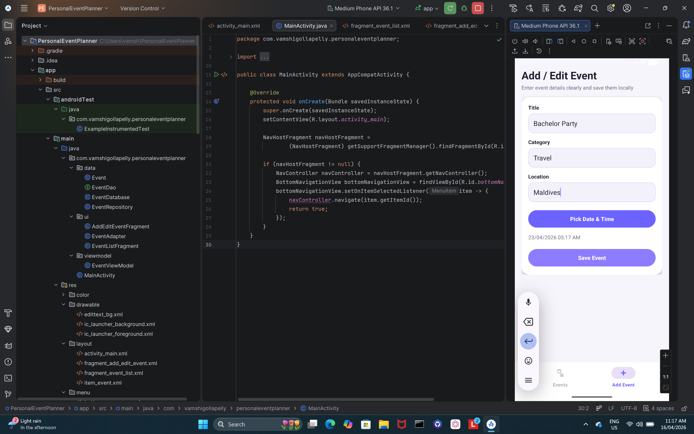
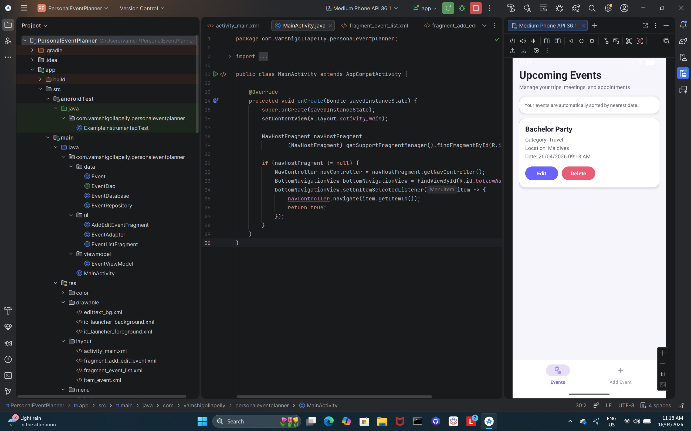

# Personal Event Planner

An Android application for managing personal events — meetings, trips, and daily tasks — with full CRUD functionality, local persistence, and a clean MVVM architecture.

---

## Features

- **Add events** — title, category (Work / Social / Travel / etc.), location, date & time
- **View events** — all saved events sorted by date, nearest first
- **Update events** — edit any existing event's details
- **Delete events** — remove events with confirmation feedback
- **Persistent storage** — data survives app close and device restart via Room Database
- **Input validation** — empty title blocked, past dates rejected, toast feedback on all actions

---

## Tech stack


| Layer | Technology |
|---|---|
| Language | Java |
| Architecture | MVVM (ViewModel + LiveData) |
| Database | Room Database (SQLite abstraction) |
| UI | RecyclerView, Bottom Navigation, Fragments |
| Navigation | Android Navigation Component |
| Build | Gradle |

---

## Architecture

```
app/
├── model/
│   └── Event.java              # Room @Entity
├── database/
│   ├── EventDao.java           # DAO — CRUD queries
│   └── EventDatabase.java      # Room database instance
├── repository/
│   └── EventRepository.java    # Single source of truth
├── viewmodel/
│   └── EventViewModel.java     # LiveData exposure to UI
└── ui/
    ├── EventListFragment.java  # Main screen — sorted event list
    └── AddEventFragment.java   # Add / edit event form
```

**Data flow:** UI observes LiveData from ViewModel → ViewModel calls Repository → Repository queries Room DAO → Room writes/reads SQLite on background thread.

---

## Screenshots


| Event List | Add Event |
|---|---|
|  |  |

---

## Getting started

### Prerequisites
- Android Studio Hedgehog or later
- Android SDK 26+
- Java 11+

### Run locally

```bash
# Clone the repo
git clone https://github.com/Vamshi-Gollapelly/PersonalEventPlanner.git

# Open in Android Studio
# File → Open → select the cloned folder

# Let Gradle sync automatically
# Run on emulator (API 26+) or physical device
```

---

## Database schema

```sql
CREATE TABLE events (
    id          INTEGER PRIMARY KEY AUTOINCREMENT,
    title       TEXT    NOT NULL,
    category    TEXT,
    location    TEXT,
    dateTime    INTEGER NOT NULL,   -- stored as Unix timestamp
    createdAt   INTEGER
);
```

---

## Validation rules

| Field | Rule |
|---|---|
| Title | Cannot be empty |
| Date & Time | Must be selected; past dates rejected |
| Category | Optional — defaults shown if blank |

---

## What I learned

- Implementing MVVM cleanly so UI never directly touches the database
- Using Room's DAO pattern to write type-safe SQL queries in Java
- Observing LiveData so the event list updates automatically on any data change
- Using the Navigation Component with Fragments instead of multiple Activities
- Handling input validation and user feedback with Toast messages

---

## Author

**Vamshi Gollapelly**
[LinkedIn](https://linkedin.com/in/vamshigollapelly) · [GitHub](https://github.com/Vamshi-Gollapelly) · [Email](mailto:vamshigollapelly225@gmail.com)
